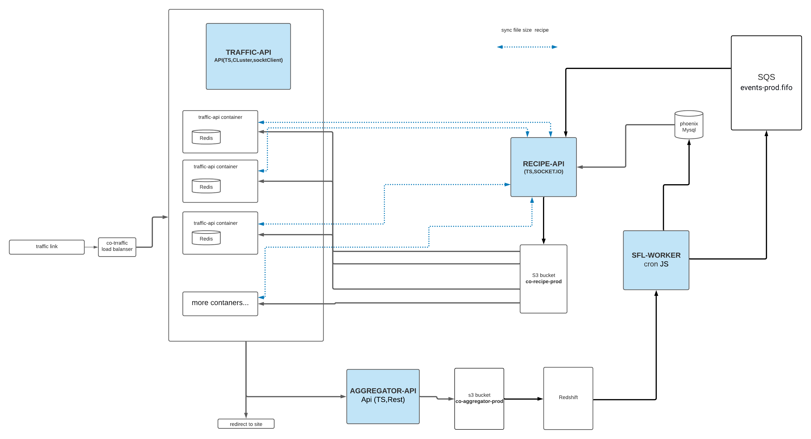

> traffic server

## Cluster

    A single instance of Node.js runs in a single thread. To take advantage of multi-core systems, the user will sometimes want to launch a cluster of Node.js processes to handle the load.
    https://nodejs.org/api/cluster.html#cluster_cluster

## Recipe

    recipe is getting from S3 bucket "co-recipe-prod"
    checking fileSizeOffersCheck && fileSizeCampaignsCheck every 20 sec 
    to co-recipe project. 
    If size of recipe is different then download new files from s3 
    and reload the data to local redis for each instances

## Redis

    each instanse has local redis with offers && campaigns populated with cron campaignsToRedisCron & offersToRedisCron

## Sockets

    use for sync size of files with co-recipe

## Update particular record inside the recipe

    if the record offer or campaign was added | updated | deleted, project co-admin-back send sqs message with offerId or campaignId to co-recipe.
    Co-recipe handle this record and send by socket to co-traffic with new data
    Co-traffic get new record and update local redis 

## Docker setup

	docker build -t co-traffic .
   	docker run -it -p 5000:5000 --rm --name co-traffic-  co-traffic

## run

    create folder on local env /tmp/co-recipe-traffic
    download maxmind DB to folder /usr/share/GeoIP/GeoIP2-City.mmdb /usr/share/GeoIP/GeoIP2-ISP.mmdb
    npm run dev

## ex link

    http://localhost:5000/ad?offer=44669c38ea032aa63b94b904804131c8:2aad25bba4a84235956c7d8884fc53b85f9f5c3f3468544ae69880a225115c5dc9822ae051f70559d674a439ca272cac&debugging=debugging
    https://co-traffic.jatun.systems/ad?offer=e3afc1dbfa2982b015f6b6fcb3e81fda:02ef3d97347b27d00f5435378160cfec31e292b63dea316ac3dd50c9c53ede65c3cfd206cc3717e60edab20a65de13d6&debugging=debugging

## check recipe
    offer
        http://localhost:5000/getRecipeData?debugging=debugging&offerId=35784
        https://co-traffic.jatun.systems/getRecipeData?debugging=debugging&offerId=35784

    campaign
        http://localhost:5000/getRecipeData?debugging=debugging&campaignId=40
        https://co-traffic.jatun.systems/getRecipeData?debugging=debugging&campaignId=40

## build

    npm run build

## env example

    HOST = localhost
    ENV = development
    PORT = 5000
    SOCKET_HOST=http://localhost:3001
    
    AWS_ACCESS_KEY_ID=
    AWS_SECRET_ACCESS_KEY=
    AWS_REGION=us-east-1
    AWS_DYNAMODB_REGION=us-west-2
    AWS_DYNAMODB_ENDPOINT=dynamodb.us-west-2.amazonaws.com
    AWS_DYNAMODB_TABLE_NAME=customOffers-production
   
    OFFERS_RECIPE_PATH=/tmp/co-recipe-traffic/offersRecipe.json.gz
    CAMPAIGNS_RECIPE_PATH=/tmp/co-recipe-traffic/campaignsRecipe.json.gz
    
    S3_OFFERS_RECIPE_PATH=offersRecipe.json.gz
    S3_CAMPAIGNS_RECIPE_PATH=campaignsRecipe.json.gz
    S3_BUCKET_NAME=co-recipe-staging
    
    MAXMIND_PATH=/usr/share/GeoIP/GeoIP2-City.mmdb
    MAXMIND_PATH_ISP=/usr/share/GeoIP/GeoIP2-ISP.mmdb

## docker build

	docker build -t co-traffic .
   	docker run -it -p 5000:5000 --rm --name co-traffic-  co-traffic

# diagram

 